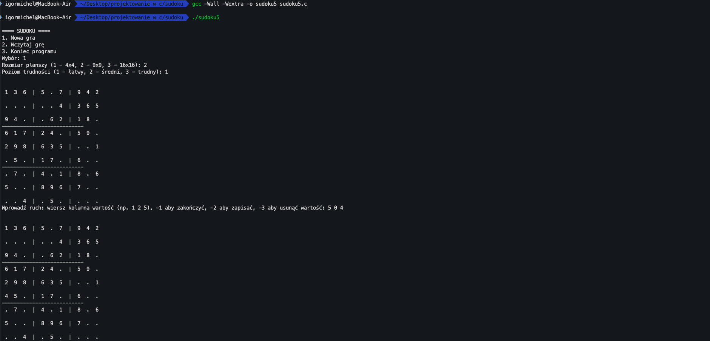
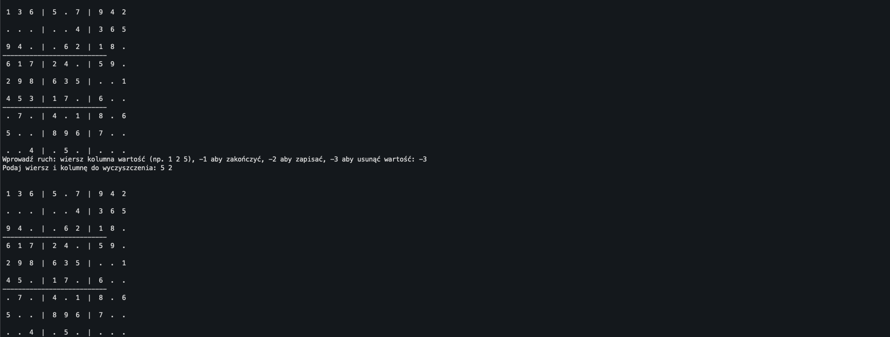
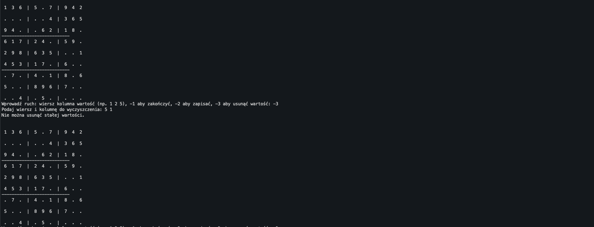
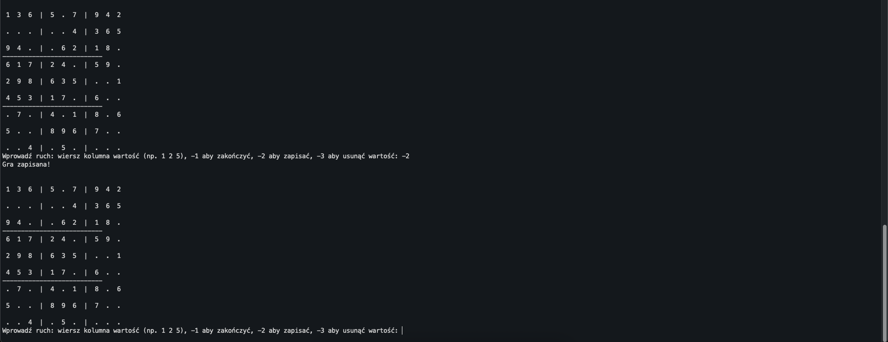
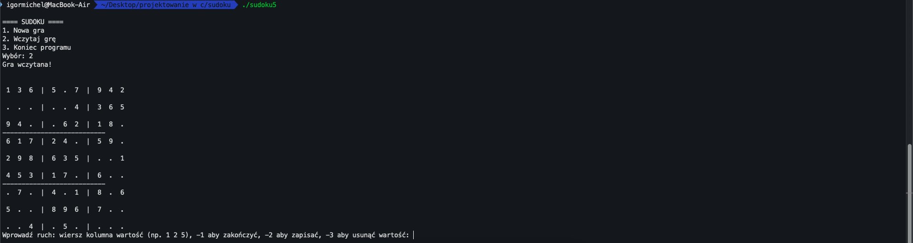

# sudoku-project

## Jak to działa
Odpalamy program przez terminal i jesteśmy pytani, czy zaczynamy nową grę, czy wczytujemy poprzednią zapisaną grę, czy wyłączamy program. Jak włączamy nową grę, to jesteśmy pytani o rozmiar planszy: czy 4x4, czy 9x9, czy 16x16, a potem o poziom trudności (łatwy, średni, trudny). Na podstawie tego tworzona jest plansza sudoku. Program wypełnia ją całą poprawnie, żeby się zgadzała z zasadami i żeby nie było błędów. Jak jest już gotowa, to jest kopiowana do osobnej tablicy, która jest potrzebna, żeby sprawdzać poprawność. Potem z planszy są usuwane liczby na podstawie poziomu trudności, żeby stworzyć luki do wypełnienia. Wtedy zaczyna się gra. Gracz wprowadza współrzędne i liczbę. Program sprawdza, czy pole jest faktycznie puste i czy liczba jest na poprawnym miejscu. Można też wyjść z rozgrywki, wpisując -1, co wraca do menu. W menu też można zakończyć program.

## Jak się gra

Włączamy program i wybieramy rozmiar planszy i poziom trudności i wypełniamy jedno pole poprawną wartością

Usuwamy wpisaną wartość

Próbujemy usunąć stałą wartość


Zapisujemy grę

Wczytujemy zapisaną grę po zamknięciu programu

## Jakieś wcześniejsze problemy

Jednym z większych problemów było to, że nie uwzględniłem, że można było zamienić wartości stałe, które miały być podpowiedziami. Zmieniłem to już i nie można. Potem jeszcze algorytm tworzący sudoku tworzył błędne sudoku albo sudoku, które można było błędnie wypełnić i gra się blokowała.

## Ulubiony mem

Trudno stwierdzić, ale może jakieś reakcje, z którymi by był jakiś tekst ironiczny (a z nowych brainrot ale to są filmiki głownie to tam).

